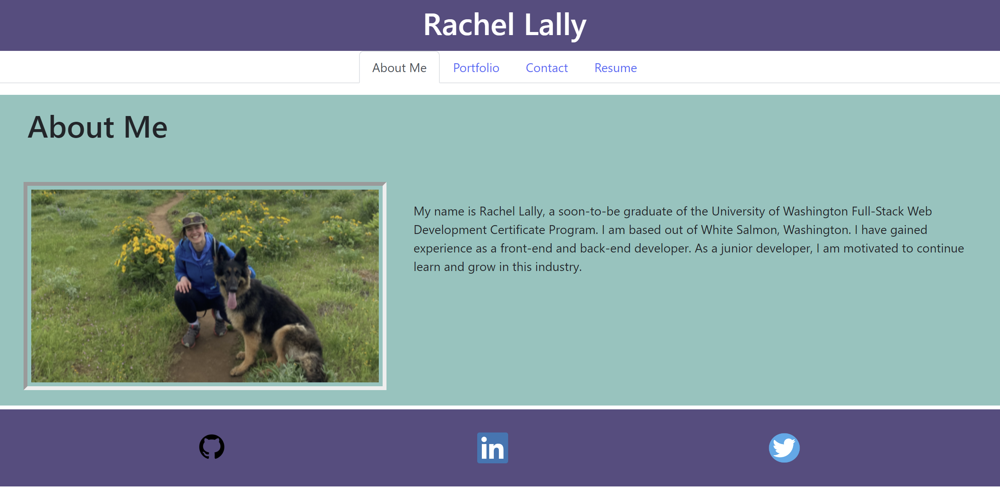

# React Portfolio
Welcome to my professional portfolio

## Description

This project was created using Create-React-App, Bootstrap, and CSS.  This purpose of this project was two parts.  First, as a web developer, it is important to create a professional portfolio to share with potential employers, collaborators, or clients.  Second, React is a modern technology used.  As a soon-to-be graduate, it will be important that I am familiar with React.

While working on my portfolio, I learned how to use React.  I better understand props, useStates, and other general functionatlity of the package.  I learned about to use CSS frameworks within React.  I learned how to link a downloadable file into a React application.

## Installation

To install, fork the repository.  Run `npm i` to install the required packages.  Run `npm start` to build the create-react-app in the localhost.

## Usage

To view my portfolio, visit: https://rachel-lally-portfolio.netlify.app/ .

Visitor is able to navigate through sections: About Me, Portfolio, Contact, and Resume.  To view my resume, the visitor can download at the link provided.

## Credits

Thank you to my instructor, TAs, and tutors at the UW Full-Stack Web Development Program.

## License

